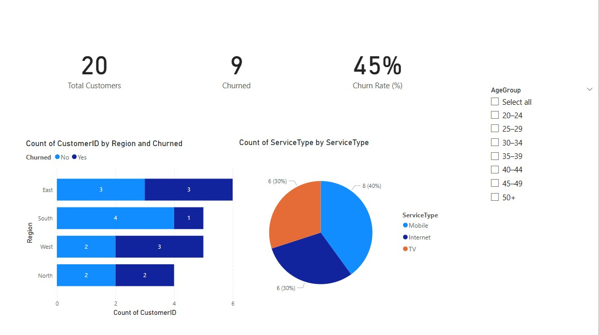
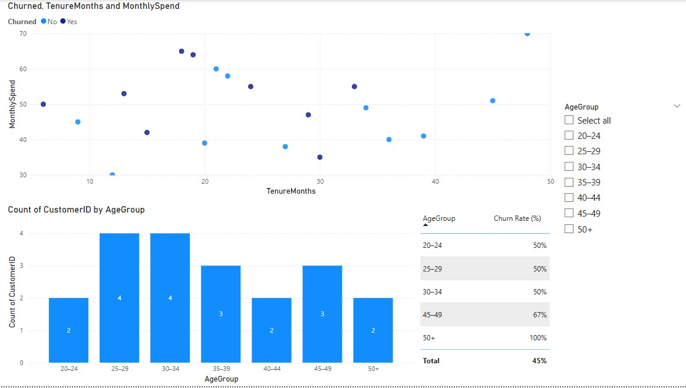

# Telecom Churn Analysis Dashboard 📊

This Power BI project analyzes customer churn data in the telecom industry to help identify trends, risk factors, and retention opportunities.

---

## 📁 Files Included

| File             | Description                                |
|------------------|--------------------------------------------|
| `dataset.csv`    | Sample dataset used for analysis           |
| `telecom-churn.pbix` | Power BI dashboard file (open in Power BI Desktop) |
| `/screenshots/`  | Preview images of the dashboard            |

---

## 📌 Objectives

- Identify key drivers of customer churn
- Visualize churn rates by region, tenure, contract type, etc.
- Assist business teams in retention planning

---

## 📊 Dashboard Features

- **KPI Cards**: Total customers, churn rate, revenue
- **Slicers**: Filter by Region, Gender, Contract Type
- **Visuals**:
  - Bar chart: Churn Rate by Region
  - Pie chart: Contract Type Breakdown
  - Line chart: Monthly Churn Trend
- **Drill-downs** for exploring churn by demographics

---

## 🧠 Key Insights

- Customers on month-to-month contracts have higher churn.
- Churn rate is notably higher in the **East region**.
- Long-tenure customers tend to be more loyal.

---

## 💾 How to Use

1. Download `telecom-churn.pbix`
2. Open it in [Power BI Desktop](https://powerbi.microsoft.com/)
3. If dataset is not found, re-link to `dataset.csv`:
   - Go to **Transform Data → Data Source Settings → Change Source**
   - Select the `dataset.csv` file in the same folder

---

## 🖼️ Preview

---

## 🛠️ Tools Used

- Power BI Desktop
- CSV data preprocessing
- DAX for calculated columns and measures

---

## 📬 Contact

If you have questions or suggestions, feel free to open an issue or connect via GitHub.